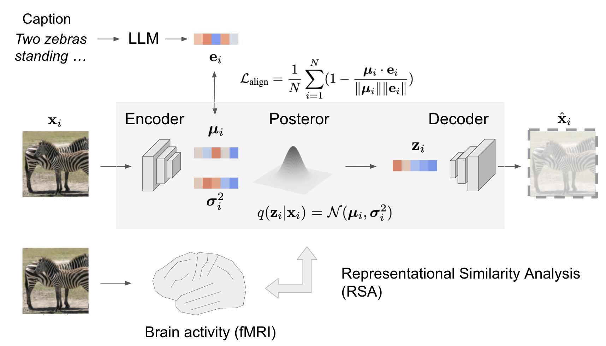

# LLM-guided Variational Autoencoder

## Overview

This repository explores whether guiding a Variational Autoencoder (VAE) with a Large Language Model (LLM) helps it learn more semantic representations and improves its representational alignment with the human visual system. We introduced an **LLM-guided VAE** whose posterior means are constrained by LLM embeddings of image captions, and evaluated it against functional magnetic resonance imaging (fMRI) data from natural scene viewing. The full thesis is available [here](thesis.pdf).



The code lets you train the model family (`encoder`, `ae`, `beta_vae`) under a standard objective, with or without LLM guidance, and evaluate how well the learned representations align with those in the visual system.

## Datasets

**Model training/evaluation data:** [Microsoft COCO](https://cocodataset.org/#home)
> Lin, T.-Y., Maire, M., Belongie, S. et al. Microsoft COCO: Common objects in context. arXiv (2014). http://arxiv.org/abs/1405.0312

**fMRI data:** [Natural Scenes Dataset](https://naturalscenesdataset.org/)
> Allen, E.J., St-Yves, G., Wu, Y. et al. A massive 7T fMRI dataset to bridge cognitive neuroscience and artificial intelligence. Nat Neurosci 25, 116–126 (2022). https://doi.org/10.1038/s41593-021-00962-x


## Environment

Computationally expensive analysis (e.g. model training) runs inside an [Apptainer](https://apptainer.org/) container on a SLURM cluster. Build the container image (`image_mini.sif`) with:

```bash
apptainer build --fakeroot --force image_mini.sif image_mini.def
```

Jobs are submitted with `sbatch` via the scripts under `cluster_run/`.

You can reproduce figures in [the thesis](thesis.pdf) using Jupyter notebooks under `notebooks/` on a local computer. First, you download the data (e.g. model checkpoints) from [the data repository](https://osf.io/wd5se/overview?view_only=18e85d996b8a482d9409e890fa8bfd4d) and place it under `data/`. Then you set up a local environment inside a VSCode [Dev Container](https://containers.dev/) (config in `.devcontainer/devcontainer.json`, built from `Dockerfile`).

Large files (e.g. h5 files for model training/testing, fMRI npy files for RSA) are not included in the data repository. Please reach out if you would like access to them.

## Configuration Parameters (`config.py`)

### Training
You set `eval_flag = False`.
`encoder` is trained from scratch. `ae` reuses the `encoder`'s weights, freezes the encoder, and trains only the decoder. `beta_vae` initializes both its encoder and decoder from the `ae`'s weights, then trains the whole model. Set the corresponding checkpoint path accordingly:
| Model             | `encoder_checkpoint` | `ae_checkpoint` | `vae_checkpoint` |
|:-----------------:|:--------------------:|:---------------:|:----------------:|
| `encoder`         | `False`              | `False`         | `False`          |
| `ae`              | `True`               | `False`         | `False`          |
| `beta_vae`        | `False`              | `True`          | `False`          |

### Evaluation
You set `eval_flag = True`.
Unlike training, you provide the checkpoint for the model you are evaluating, so the variables are set as follows. 
| Model             | `encoder_checkpoint` | `ae_checkpoint` | `vae_checkpoint` |
|:-----------------:|:--------------------:|:---------------:|:----------------:|
| `encoder`         | `True`               | `False`         | `False`          |
| `ae`              | `False`              | `True`          | `False`          |
| `beta_vae`        | `False`              | `False`         | `True`           |
